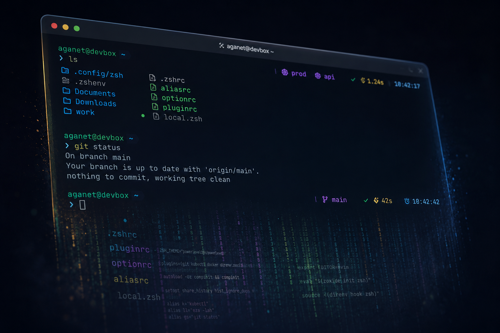

# My zsh config



Cross-platform zsh config for macOS, Arch, Fedora, and Linux VMs.

Built on **Oh My Zsh + Powerlevel10k**, with modern CLI tools (`eza`, `bat`, `fd`, `zoxide`, `direnv`, `fzf-tab`, `delta`) and DevOps aliases for `kubectl`, `docker`, `terraform`, `helm`, `aws`, `az`, `gh`, `uv`, `mise`, and more.

- OS-aware (macOS / Arch / Fedora / Linux)
- Conditional plugins (`command -v` gated)
- XDG-based (`~/.config/zsh`)
- Same config on every machine

Repo: [github.com/aganet/zsh](https://github.com/aganet/zsh)

---

## What it looks like

- **Powerlevel10k prompt** with git status, k8s context, command runtime
- **`<TAB>` opens fzf** with bat/eza previews
- **`delta` for git diffs**; pair with `lazygit` for staging/rebasing
- **`s`** opens a fuzzy kubeconfig picker (kubeswitch)
- **`z <name>`** jumps to any directory you've visited

---

## Structure

```text
~/.zshenv
~/.config/zsh/
├── .zshrc
├── pluginrc
├── optionrc
├── aliasrc
├── local.zsh
└── .p10k.zsh
```

- `pluginrc` → plugins
- `optionrc` → shell options + history
- `aliasrc` → aliases
- `local.zsh` → machine-specific overrides (git-ignored)

---

## Install

### Prerequisites

`zsh` ≥ 5.8, `git`, and a [Nerd Font](https://www.nerdfonts.com/font-downloads) (recommended: JetBrainsMono Nerd Font).

### 1. Clone the repo

```bash
git clone https://github.com/aganet/zsh.git ~/.config/zsh

touch ~/.zshenv
grep -qxF 'export ZDOTDIR="$HOME/.config/zsh"' ~/.zshenv || \
  echo 'export ZDOTDIR="$HOME/.config/zsh"' >> ~/.zshenv
```

### 2. Oh My Zsh + Powerlevel10k + custom plugins

```bash
sh -c "$(curl -fsSL https://raw.githubusercontent.com/ohmyzsh/ohmyzsh/master/tools/install.sh)" "" --unattended --keep-zshrc

git clone --depth=1 https://github.com/romkatv/powerlevel10k.git \
  ${ZSH_CUSTOM:-$HOME/.oh-my-zsh/custom}/themes/powerlevel10k

ZSH_CUSTOM="${ZSH_CUSTOM:-$HOME/.oh-my-zsh/custom}"
git clone --depth=1 https://github.com/zsh-users/zsh-autosuggestions          "$ZSH_CUSTOM/plugins/zsh-autosuggestions"
git clone --depth=1 https://github.com/zdharma-continuum/fast-syntax-highlighting "$ZSH_CUSTOM/plugins/fast-syntax-highlighting"
git clone --depth=1 https://github.com/Aloxaf/fzf-tab                         "$ZSH_CUSTOM/plugins/fzf-tab"
```

### 3. CLI tools (Homebrew)

On Linux, install Homebrew first:

```bash
/bin/bash -c "$(curl -fsSL https://raw.githubusercontent.com/Homebrew/install/main/install.sh)"
```

Then:

```bash
brew install \
  zsh fzf fd bat eza ripgrep zoxide git-delta gh lazygit tldr btop \
  direnv neovim tmux mise \
  kubectl kubectx helm terraform terragrunt k9s awscli stern azure-cli kind opentofu \
  yq jq pre-commit vault httpie dive

$(brew --prefix)/opt/fzf/install --key-bindings --completion --no-update-rc

curl -LsSf https://astral.sh/uv/install.sh | sh
mise use --global node@22 python@3.12
```

Prefer native package managers? Install equivalent binaries via `pacman`, `dnf`, or `apt` - everything is `command -v`-gated.

**Docker:**

- **macOS** - `brew install --cask docker` or `brew install colima && colima start`
- **Arch** - `sudo pacman -S docker docker-buildx docker-compose && sudo systemctl enable --now docker`
- **Ubuntu / Debian / Fedora** - see [docker.com/engine/install](https://docs.docker.com/engine/install/)

**kubeswitch** (for the `s` alias):

```bash
sudo curl -L -o /usr/local/bin/switcher \
  https://github.com/danielfoehrKn/kubeswitch/releases/latest/download/switcher_linux_amd64
sudo chmod +x /usr/local/bin/switcher
```

### 4. Set zsh as your login shell

```bash
chsh -s "$(command -v zsh)"
```

### 5. (Optional) Wire `delta` into git

```bash
git config --global core.pager "delta"
git config --global interactive.diffFilter "delta --color-only"
git config --global delta.navigate true
git config --global delta.line-numbers true
git config --global delta.side-by-side true
git config --global merge.conflictstyle "zdiff3"
```

---

## Cheat sheet

| Keys / cmd                | What                              |
|---------------------------|-----------------------------------|
| `Ctrl-T`                  | Fuzzy-pick a file path            |
| `Alt-C`                   | Fuzzy-pick a dir and `cd` into it |
| `Ctrl-R`                  | Fuzzy history search              |
| `<TAB>`                   | fzf completion menu               |
| `z <name>` / `zi`         | Jump to dir via zoxide            |
| `s`                       | Kubeconfig picker (kubeswitch)    |
| `git diff` / `lazygit`    | Delta-colored diff / git TUI      |
| `tldr <cmd>`              | Quick examples                    |
| `btop`                    | System monitor                    |
| `.envrc` + `direnv allow` | Per-directory env vars            |
| `reload`                  | `exec zsh`                        |
| `update`                  | Update system + brew + mise + OMZ |

---

## Examples

```sh
# Kubernetes
s
kctx prod && kns api
k get pods -A
kpf svc/myapp 8080:80
kdebug
ks 'web-.*'

# Navigation
z api
zi
nvim $(fzf)

# Docker
dcu && dcl
dex web bash
dprune

# Python
uvenv && uva fastapi httpx
uvr main.py
uvx ruff check .

# Git
git diff           # delta side-by-side
lazygit
ghpr
ghprs
```

---

## Aliases

All in `aliasrc`, each block gated by `command -v <tool>`. Inspect the file for the full list.

### Kubernetes

| Alias                                 | Command                                       |
|---------------------------------------|-----------------------------------------------|
| `k`                                   | `kubectl`                                     |
| `kpf`                                 | `kubectl port-forward`                        |
| `kev`                                 | `kubectl get events --sort-by=.lastTimestamp` |
| `kaa`                                 | `kubectl get all --all-namespaces`            |
| `ktop` / `kapi`                       | `kubectl top` / `kubectl api-resources`       |
| `kdebug`                              | ephemeral `netshoot` pod                      |
| `kctx` / `kns`                        | `kubectx` / `kubens`                          |
| `ks` / `k9`                           | `stern` / `k9s`                               |
| `s`                                   | `switcher` (kubeswitch)                       |
| `kindc` / `kindd` / `kindg` / `kindl` | `kind` create / delete / get / load-image     |

### Docker

| Alias                                                 | Command                                               |
|-------------------------------------------------------|-------------------------------------------------------|
| `d` / `dps` / `dpsa` / `di`                           | `docker` / `ps` / `ps -a` / `images`                  |
| `dex` / `dlog` / `drun`                               | `exec -it` / `logs -f` / `run --rm -it`               |
| `dstats` / `dprune` / `dip`                           | `stats` / `system prune -af --volumes` / container IP |
| `dc` / `dcu` / `dcd` / `dcl` / `dcps` / `dcb` / `dcr` | `docker compose …`                                    |

### Terraform / OpenTofu

| Alias                                         | Command                                                                     |
|-----------------------------------------------|-----------------------------------------------------------------------------|
| `tf` / `tfi` / `tfp` / `tfa` / `tfaa` / `tfd` | `terraform` / `init` / `plan` / `apply` / `apply -auto-approve` / `destroy` |
| `tfo` / `tfs` / `tff` / `tfv` / `tfw`         | `output` / `state` / `fmt -r` / `validate` / `workspace`                    |
| `to`                                          | `tofu`                                                                      |

### Helm

| Alias               | Command                                       |
|---------------------|-----------------------------------------------|
| `h` / `hls` / `hla` | `helm` / `list` / `list -A`                   |
| `hi` / `hu` / `hup` | `install` / `uninstall` / `upgrade --install` |
| `hr` / `ht`         | `repo` / `template`                           |

### AWS / Azure

| Alias                               | Command                                                             |
|-------------------------------------|---------------------------------------------------------------------|
| `awsw` / `awsl` / `awsr`            | `sts get-caller-identity` / `sso login` / `configure list-profiles` |
| `azl` / `azlo` / `azw`              | `az login` / `logout` / `account show`                              |
| `azacc` / `azset` / `azg` / `azaks` | account list / set / group list / aks get-credentials               |

### Python (uv)

| Alias                    | Command                                   |
|--------------------------|-------------------------------------------|
| `uvi` / `uvr` / `uvs`    | `pip install` / `run` / `sync`            |
| `uva` / `uvrm`           | `add` / `remove`                          |
| `uvenv` / `uvpy` / `uvx` | `venv` / `python install` / one-shot tool |

### GitHub CLI

| Alias                                                     | Command                                      |
|-----------------------------------------------------------|----------------------------------------------|
| `ghv` / `ghc` / `ghf`                                     | `repo view --web` / `clone` / `fork --clone` |
| `ghpr` / `ghprl` / `ghprv` / `ghprco` / `ghprm` / `ghprs` | `pr` subcommands                             |
| `ghi` / `ghil` / `ghiv`                                   | `issue` subcommands                          |
| `ghrun` / `ghwatch` / `gha`                               | `run list` / `run watch` / `auth status`     |

### Git extras

| Alias    | Command                                            |
|----------|----------------------------------------------------|
| `gpr`    | `git pull --rebase`                                |
| `gprune` | fetch + delete local branches whose remote is gone |

### System / networking

| Alias                                    | What                                                  |
|------------------------------------------|-------------------------------------------------------|
| `myip` / `localip`                       | public IP / LAN IP                                    |
| `ports` / `listening`                    | sockets / listening TCP                               |
| `psg` / `mem` / `cpu`                    | fuzzy ps / top RAM / top CPU                          |
| `weather` / `path` / `reload` / `update` | `wttr.in` / `echo $PATH` / `exec zsh` / system update |

---

## Troubleshooting

- **Garbled prompt / boxes** - install a Nerd Font in your terminal.
- **fzf-tab inactive** - must load before `fast-syntax-highlighting` in `plugins=(…)`.
- **`compinit: insecure directories`** - `compaudit | xargs -I{} chmod g-w,o-w "{}"`.
- **Slow startup** - profile with `time zsh -i -c exit` or `zmodload zsh/zprof` + `zprof`.
- **Per-OS plugin not loading** - check `echo $CURRENT_OS`.
- **`Error: context with name "init" not found`** - kubeswitch binary is too old; upgrade it.
- **Stale hooks after uninstalling something** - `exec zsh`.

---

## Not included

- `atuin` - native history + fzf's `Ctrl-R` is enough
- `zsh-vi-mode` - emacs at the prompt, vim in the editor
- `starship` - p10k's instant prompt is faster

---

## License

MIT License. Use it, tweak it, fork it.
